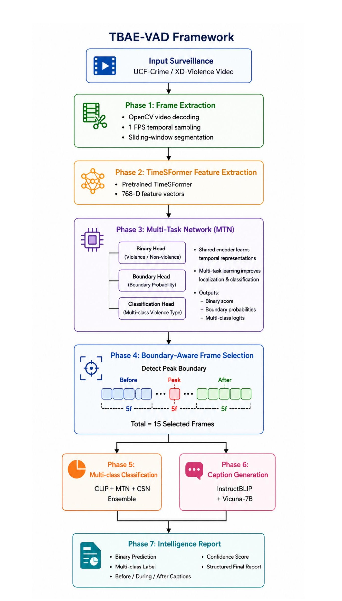
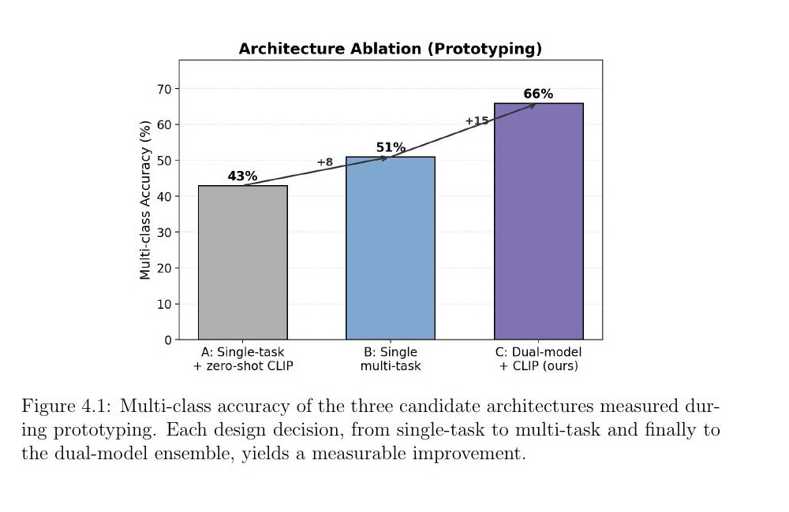
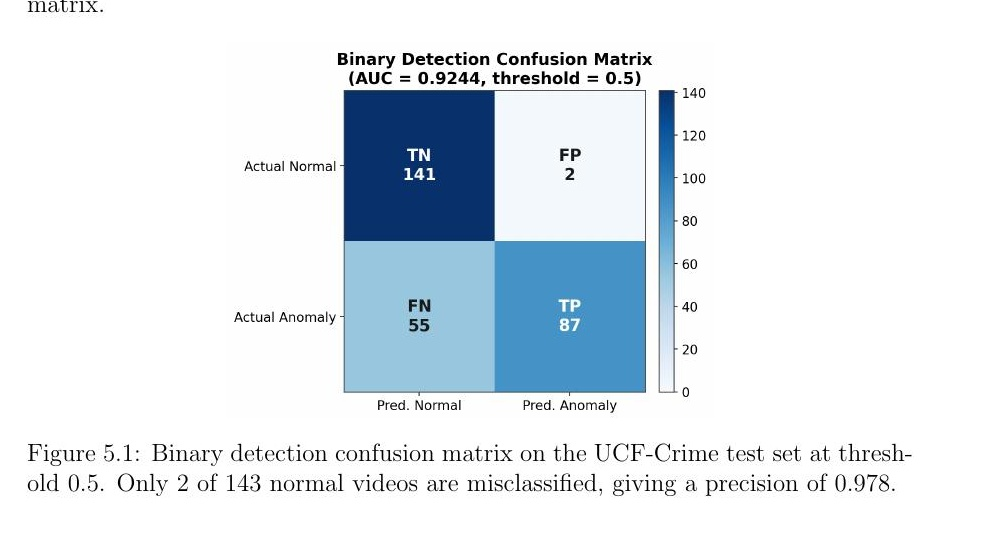
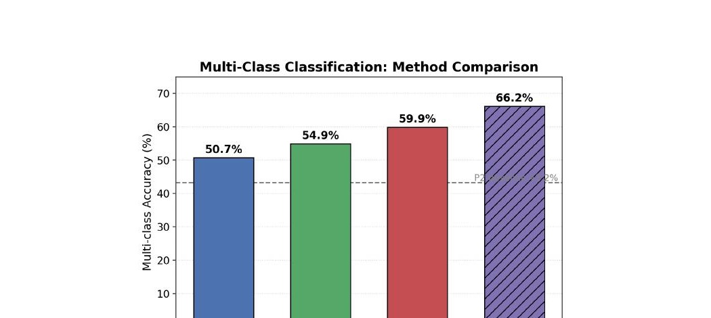
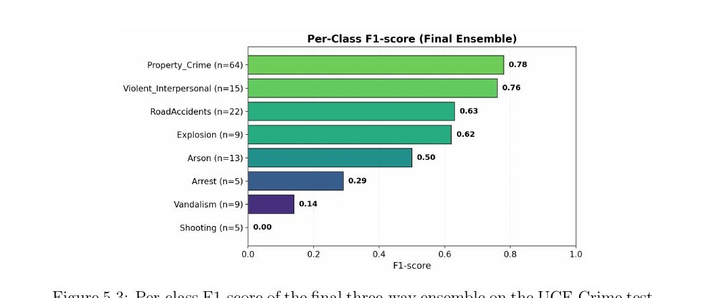
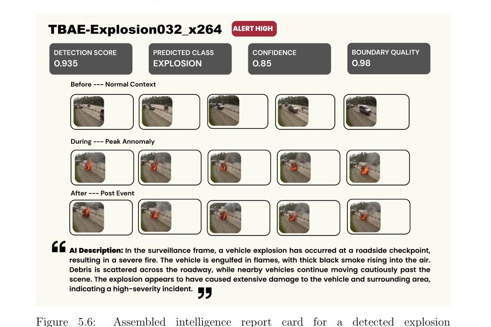
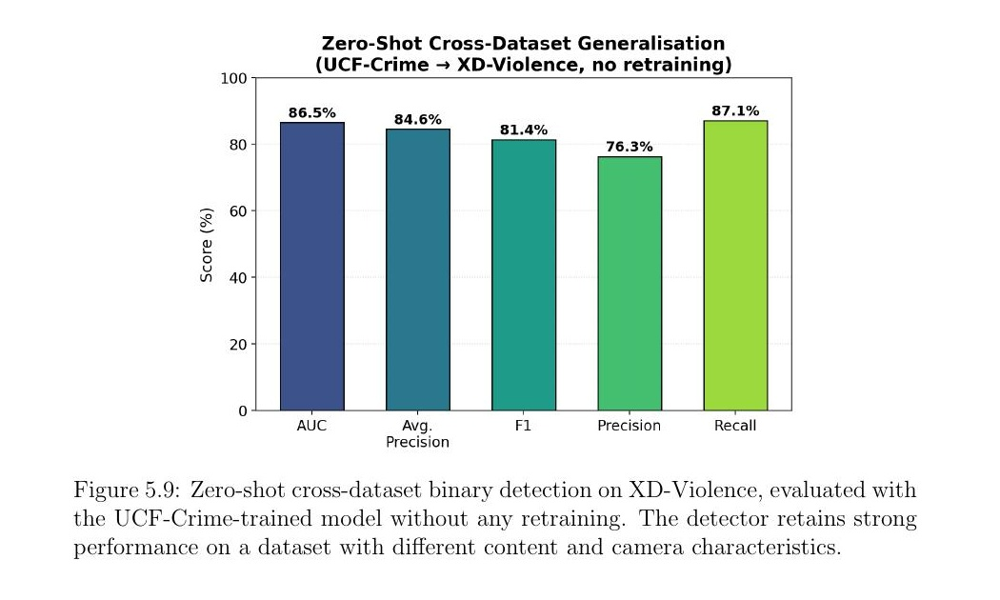

<div align="center">

# 🎥 TBAE-VAD
### Temporal Boundary-Aware Explainable Video Anomaly Detection

**A weakly-supervised pipeline that watches surveillance video and writes the incident report itself.**

Detects → Localizes → Classifies → Explains — using only video-level labels, no frame annotation.


**0.92 AUC detection · 66.2% multi-class accuracy · 86.5% zero-shot transfer to a second dataset**

</div>

---

## 🧠 The Problem

Most surveillance anomaly detectors give you one bit of information: *anomaly or not*. They can't tell you **what** happened, **when** it started, or **why** it was flagged — so a human still has to scrub through hours of footage.

**TBAE-VAD** closes that gap end-to-end: raw video in, a structured, human-readable **incident report** out.

---

## 🏗️ System Architecture

Seven phases, one pipeline — from raw video to a written report, with no frame-level labels anywhere in the loop.

<p align="center">
  
</p>

| Phase | What it does |
|---|---|
| **1. Frame Extraction** | OpenCV decode, 1 FPS sampling, sliding-window segmentation |
| **2. TimeSformer Features** | Pretrained spatiotemporal backbone → 768-D embeddings |
| **3. Multi-Task Network (MTN)** | One shared encoder, three heads: binary detection, boundary localization, class discrimination |
| **4. Boundary-Aware Frame Selection** | Learns *onset/peak/offset* instead of a fixed threshold → 15 Before/Peak/After frames |
| **5. Multi-Class Ensemble** | Fuses CLIP (fine-tuned) + MTN + a dedicated Class-Specialized Network (CSN) |
| **6. Caption Generation** | InstructBLIP + Vicuna-7B, class-conditioned prompts → natural-language Before/During/After descriptions |
| **7. Intelligence Report** | Consolidates every phase into one operator-facing report card |

---

## 📈 Results That Mattered

### Every architecture decision was measured, not assumed

Three candidate designs were prototyped before committing to the dual-model ensemble — each iteration bought a real accuracy gain.

<p align="center">
  
</p>

### Binary detection: high-precision, human-in-the-loop friendly

At the default threshold, only **2 of 143** normal videos are misclassified — a precision built for a system where a human reviews every flag.

<p align="center">
  
</p>

### Multi-class classification: ensembling beats every individual model

Motion-based models (MTN, CSN) and appearance-based CLIP fail on largely disjoint classes — which is exactly why fusing them adds **+6.3 points** over the best single model.

<p align="center">
  
  
</p>

### The payoff: an automatically-written intelligence report

This is Phase 7's actual output — detection score, predicted class, confidence, boundary quality, the exact frames the model used as evidence, and a generated natural-language description, all assembled with zero manual writing.

<p align="center">
  
</p>

### It generalizes — zero-shot, no retraining

Trained only on UCF-Crime, evaluated cold on XD-Violence — a dataset with different content and camera characteristics.

<p align="center">
  
</p>

---

## 📊 Headline Numbers

| Metric | Score | Context |
|---|---|---|
| Binary detection AUC (UCF-Crime) | **0.92** | 2/143 false positives at default threshold |
| Multi-class accuracy (8-class ensemble) | **66.2%** | +23 pts over zero-shot CLIP baseline (43.2%) |
| Zero-shot cross-dataset AUC (XD-Violence) | **86.5%** | No retraining, unseen dataset |
| Boundary quality (mean, 1,894 videos) | **0.904** | 0 videos in the low-quality band |
| Caption completion rate | **719 / 719** | Every detected anomaly gets a report |

---

## 🔬 What Makes This Different

- **Learned temporal boundaries, not fixed thresholds** — a dedicated boundary head locates onset/peak/offset per video, handling gradual anomalies (e.g. shoplifting) that fixed-window selection misses.
- **Two novel loss terms** — a *boundary sharpness loss* and a *temporal contrastive loss*, both trained with only video-level labels.
- **Dual-model design over a single shared backbone** — a class-specialized network is trained separately to remove feature interference between detection and classification objectives.
- **Semantically-merged taxonomy** — 13 UCF-Crime categories collapsed into 8 coherent classes, validated with CLIP text-embedding clustering rather than manual grouping.
- **Vision + language fusion for explainability** — CLIP handles *what class*, InstructBLIP handles *what happened*, combined into a single report.

---

## 🛠️ Tech Stack

`Python 3.10` · `PyTorch 2.x` · `TimeSformer` · `OpenAI CLIP` · `HuggingFace Transformers` · `InstructBLIP (Vicuna-7B, FP16)` · `OpenCV` · `NumPy / SciPy / scikit-learn` · `Matplotlib` · `Jupyter`

Trained and evaluated on an NVIDIA RTX 4080 SUPER (16GB VRAM).

---

## 📁 Repository Structure

```
tbae-vad/
├── phase1_frame_extraction/       # OpenCV decoding, 1 FPS sampling, windowing
├── phase2_timesformer_features/   # Pretrained backbone → 768-D features
├── phase3_multi_task_network/     # MTN: binary + boundary + class heads
├── phase4_boundary_selection/     # Peak/onset/offset detection, frame sampling
├── phase5_classification_ensemble/# CLIP fine-tuning + CSN + MTN fusion
├── phase6_caption_generation/     # InstructBLIP class-conditioned captioning
├── phase7_report_assembly/        # Final intelligence report synthesis
├── configs/                       # Training configs, seeds, hyperparameters
├── checkpoints/                   # Trained model weights
└── notebooks/                     # Per-phase experimentation notebooks
```

## ⚙️ Setup

```bash
git clone https://github.com/<your-username>/tbae-vad.git
cd tbae-vad
pip install -r requirements.txt
```

## ▶️ Run the Pipeline

```bash
# Phase 1–2: extract frames and features
python phase1_frame_extraction/extract.py --video_dir data/UCF-Crime
python phase2_timesformer_features/embed.py --frames_dir data/frames

# Phase 3: train the multi-task network
python phase3_multi_task_network/train.py --config configs/mtn.yaml

# Phase 5–7: classify, caption, and assemble a report for a single video
python phase7_report_assembly/generate_report.py --video Explosion032_x264.mp4
```

---

## 📚 Citation & Acknowledgements

Built on **TimeSformer**, **CLIP**, and **InstructBLIP**, evaluated on the **UCF-Crime** and **XD-Violence** datasets. Full methodology, ablations, and statistical analysis are documented in the accompanying thesis, *TBAE-VAD: A Temporal Boundary-Aware Interpretable Hierarchical Framework for Explainable Video Anomaly Detection Combining Multi-Task MIL and Vision-Language Models* (Brac University, 2026).

<div align="center">

**Sabbir Ahmad · Rakib Hasan · MD Shourav Ansary · MD. Zunaed Islam**

Department of Computer Science and Engineering, Brac University

</div>
